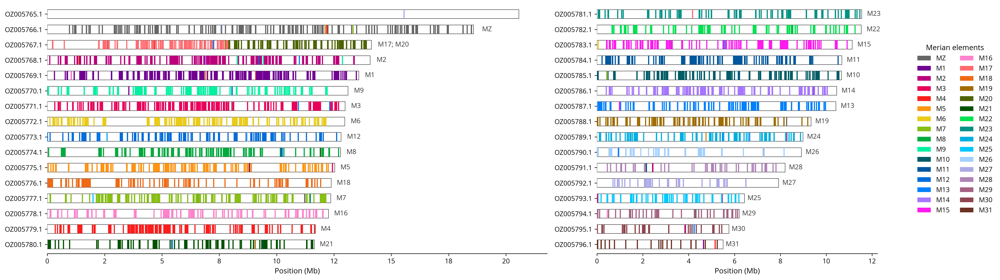
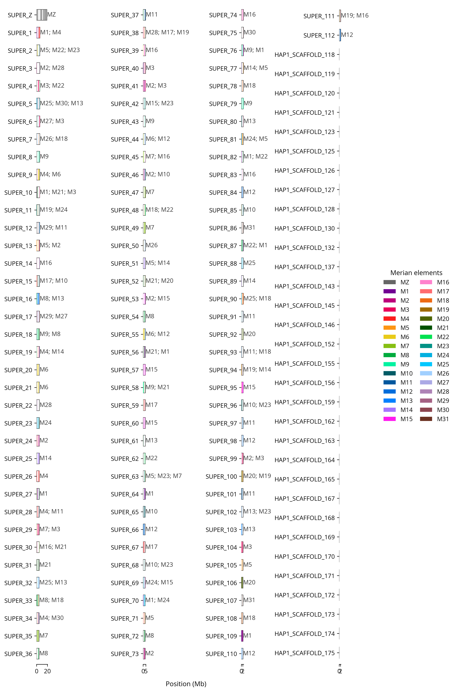

# merian-busco-painter

Utilities for plotting Merian element assignments from BUSCO `full_table.tsv` files,
adapted for genome notes workflows.

Merian elements are 32 ancestral chromosome building blocks found in the genomes of
moths and butterflies (Lepidoptera), which have remained largely intact for over
250 million years (Wright *et al*. 2024, doi:[10.1038/s41559-024-02329-4](https://doi.org/10.1038/s41559-024-02329-4)).

This code is derived from
[`charlottewright/lep_busco_painter`](https://github.com/charlottewright/lep_busco_painter)
and uses the same Merian reference table. The main changes in this version are:

- a Python plotting module instead of the original R plotter
- inclusion of duplicated BUSCO hits in the location table and plot
- chromosome length lookup from the NCBI Datasets API `sequence_reports` endpoint
- modifications to the appearance of the Merian plot for use in genome note publications
- automatic multi-column plotting for assemblies with more than 20 plotted
  chromosomes/scaffolds by default
- an installable Python package with a single plot command for final and draft
  assembly modes
- a batch wrapper for running multiple ToLIDs from genome notes working directories.

## Important assumption

The bundled `Merian_elements_full_table.tsv` reference table is based on BUSCO
`odb10`. These scripts therefore currently assume that the input
`full_table.tsv` files were generated with the corresponding BUSCO `odb10`
database used to build that reference table.

If you run BUSCO with a different database version, BUSCO identifiers will not
match the reference table correctly. 

## Plot appearance

The plotting step in this repository was reimplemented in Python with
`matplotlib`, as an alternative to the original R plotting scripts from
`lep_busco_painter`.

This was done partly for easier integration into genome notes workflows, but
also to improve figure appearance and control. In particular, the Python
plotting code makes it easier to:

- control font selection and fallback behaviour more cleanly
- place Merian labels for each chromosome to improve interpretation of the plot
- tune figure sizing and spacing for genome note outputs
- split large karyotypes across columns while keeping a consistent Mb scale across panels
- write PNG and SVG outputs directly from the same code path
- customise palette choices while keeping the style reproducible.

The underlying BUSCO-to-Merian interpretation is the same, but the plotting
layer is easier to maintain and better suited to publication-style figure
preparation.

## Files

- `src/merian_busco_painter/`: installable Python package
- `buscopainter.py`: compatibility wrapper for `merian-busco-painter paint`
- `plot_buscopainter.py`: compatibility wrapper for `merian-busco-painter plot`
- `busco_to_merian.sh`: batch wrapper for ToLID lists
- `Merian_elements_full_table.tsv`: reference BUSCO-to-Merian table
- `LICENSE`: MIT license retained for the adapted codebase

## Requirements

- Python 3.10+
- `pandas`
- `matplotlib`
- `requests`

For local development, install with:

```bash
python3 -m pip install -e .
```

This provides:

```bash
merian-busco-painter --help
merian-busco-painter paint --help
merian-busco-painter plot --help
```

The shorter alias `mbp` is also installed.

## One plotter, two assembly modes

The package has one plotting command, `merian-busco-painter plot`, with an
explicit `--assembly-mode` option:

- `--assembly-mode final`: use the painter-generated `chrom_lengths.tsv`
  (`Chrom`/`Length_Mb`) for a public chromosome-scale assembly
- `--assembly-mode draft`: use a local `.fai` for scaffold/contig lengths
- `--assembly-mode auto`: detect the format of the supplied `--lengths` file

If you run `merian-busco-painter paint` with `--accession`, chromosome lengths are fetched
from the NCBI Datasets `sequence_reports` endpoint. In that mode, the plot is
chromosome-focused: plotting units are assembled chromosomes, and lengths from
unlocalised scaffolds are added to their parent chromosome. This is the mode
intended for public assemblies and genome note figures. In this mode, the
plotted chromosome names come from the GenBank accessions returned by NCBI
Datasets.

If you do not provide `--accession`, curation assemblies can be plotted against
real scaffold lengths by passing a `.fai` file to `merian-busco-painter plot` with
`--lengths`. In this mode, plotted names come directly from the sequence
identifiers in the BUSCO table and `.fai` index, and scaffold lengths come from
the index. Because the `.fai` defines the plotting units, scaffold entries from
that index appear as plotted rows.

The plotting step accepts either the NCBI-derived `chrom_lengths.tsv` written
by `merian-busco-painter paint` or a standard `.fai` index. Estimating lengths directly
from BUSCO positions is a last-resort fallback when no
lengths file is available.

### Route 1: Genome note mode

Use this when you have an assembly accession and want a chromosome-focused plot
for a public assembly or genome note figure.

```bash
mkdir -p output/ilHelArmi9

merian-busco-painter paint \
  --query_table data/ilHelArmi9/full_table.tsv \
  --prefix output/ilHelArmi9/ \
  --accession GCA_963930815.1

merian-busco-painter plot \
  --file output/ilHelArmi9/all_location.tsv \
  --lengths output/ilHelArmi9/chrom_lengths.tsv \
  --assembly-mode final \
  --prefix output/ilHelArmi9/ilHelArmi9 \
  --palette merianbow4 \
  --label-threshold 5 \
  --panel-size 20 \
  --max-columns 2
```

In this mode:

- `merian-busco-painter paint` writes `chrom_lengths.tsv`
- `merian-busco-painter plot` must use that `chrom_lengths.tsv` as `--lengths`
- the plotted units are assembled chromosomes only
- unlocalised scaffolds are added onto their parent chromosome length rather
  than plotted separately

### Route 2: Draft scaffold mode

Use this when you want to plot against scaffold lengths from a local assembly index.

```bash
mkdir -p output/ilApoPilo2

merian-busco-painter paint \
  --query_table data/ilApoPilo2/full_table.tsv \
  --prefix output/ilApoPilo2/

merian-busco-painter plot \
  --file output/ilApoPilo2/all_location.tsv \
  --lengths data/ilApoPilo2.fa.fai \
  --assembly-mode draft \
  --prefix output/ilApoPilo2/ilApoPilo2 \
  --palette merianbow4 \
  --label-threshold 5 \
  --panel-size 20 \
  --max-columns 3
```

In this mode:

- `merian-busco-painter paint` does not fetch chromosome lengths
- `merian-busco-painter plot` uses a local `.fai` as `--lengths`
- the plotted units come from sequence names in the `.fai`
- scaffold entries from the index can appear as separate plotted rows

Do not mix these routes. In particular:

- if you ran `merian-busco-painter paint` with `--accession`, plot with the generated
  `chrom_lengths.tsv`, not a `.fai`
- if you pass a `.fai` to `merian-busco-painter plot`, you are using scaffold mode,
  even if you also ran `merian-busco-painter paint` with `--accession`

Outputs from `merian-busco-painter paint`:

- `all_location.tsv`
- `chrom_lengths.tsv` when `--accession` is used
- `*.png`
- `*.svg`

If an assembly has many chromosomes, `merian-busco-painter plot` can split the figure
into columns automatically. `--panel-size` sets the target number of
chromosomes/scaffolds per column. The default is `20`, so most Lepidoptera
chromosome-scale assemblies are plotted as two columns. Very large scaffold
sets are capped at three columns by default and made taller instead of becoming
very wide. Use `--max-columns 1` to force a single-panel plot.


## Batch workflow for genome notes

The wrapper expects to be run from a directory containing:

- `tolids_accessions.tsv` or `tolid_accessions.tsv`: tab-separated file with at least `ToLID<TAB>assembly_accession`

By default, the wrapper uses the first column of the accession table as the
ToLID list. Set `TOLID_FILE` explicitly only when you want to run a subset or a
custom order.

Run:

```bash
bash busco_to_merian.sh
```

The wrapper is environment-variable driven. By default it uses:

- `DATA_ROOT=.` 
- `BUSCO_DIR=${DATA_ROOT}/busco`
- `OUTPUT_DIR=${DATA_ROOT}/merians`

You can override any of these:

```bash
DATA_ROOT=/path/to/project_data \
ACCESSION_FILE=tolids_accessions.tsv \
MERIAN_REF=Merian_elements_full_table.tsv \
BUSCO_DIR=/path/to/busco \
OUTPUT_DIR=/path/to/output \
bash busco_to_merian.sh
```

If you prefer, keep the variables in a shell file and source them before
running the batch script:

```bash
source .env
bash busco_to_merian.sh
```

## Example data

Public assembly example for `ilHelArmi9` (`GCA_963930815.1`):

- BUSCO table: [examples/ilHelArmi9_full_table.tsv](examples/ilHelArmi9_full_table.tsv)
- length source: NCBI Datasets `sequence_reports` via accession `GCA_963930815.1`
- plot output: `examples/ilHelArmi9.png`

This example uses the public assembly accession to fetch chromosome lengths
from NCBI. Plotted rows are assembled chromosomes, and labels are GenBank
chromosome accessions.



Local `.fai` example for `ilApoPilo2`, a curation in progress:

- BUSCO table: [examples/ilApoPilo2_full_table.tsv](examples/ilApoPilo2_full_table.tsv)
- scaffold index: [examples/ilApoPilo2.fa.fai](examples/ilApoPilo2.fa.fai)
- plot output: `examples/ilApoPilo2.png`

This example uses a `.fai` index so all BUSCO-bearing scaffolds are plotted
against their true lengths. Plotted rows come from sequence identifiers in the
`.fai` file rather than NCBI chromosome accessions.




## Notes

- `merian-busco-painter paint` keeps both `Complete` and `Duplicated` BUSCO records.
- BUSCO inputs should currently be generated with the `odb10` database version
  compatible with `Merian_elements_full_table.tsv`.
- Chromosome lengths come from NCBI Datasets `sequence_reports`, using the main
  assembled-molecule accession and summing any unlocalized scaffolds assigned to
  that chromosome.
- In NCBI-driven plots, chromosome labels are the assembled-molecule GenBank
  accessions returned by Datasets rather than original assembly header names.
- For curation assemblies, `merian-busco-painter plot` can use a `.fai` index to
  plot assembly sequences against their true scaffold lengths.
- Without a lengths file, the fallback plot includes all BUSCO-bearing
  `query_chr` values from the BUSCO table and estimates their lengths from BUSCO
  extent only.
- The plotting script labels each scaffold/chromosome with Merian elements that
  meet the `--label-threshold`.
- Large chromosome sets can be split across columns with `--panel-size` and
  capped with `--max-columns`.
  Chromosome-scale plots preserve a common Mb scale across panels; large
  scaffold-heavy plots use equal-width panels so shorter scaffolds stay
  legible. The current layout favours a narrower, taller figure for print and
  web use.
- If Open Sans is available locally it will be used automatically; otherwise
  matplotlib's default sans-serif font is used.


## Attribution

This code adapts ideas, scripts and reference data from
[`charlottewright/lep_busco_painter`](https://github.com/charlottewright/lep_busco_painter).

The `MerianBow4` palette used here is credited to [Arnaud Martin](<https://biology.columbian.gwu.edu/arnaud-martin>).

## Citation

This repository uses the Merian element framework described in:

Wright CJ, et al. 2024. Comparative genomics reveals the dynamics of chromosome evolution in Lepidoptera. *Nature Ecology & Evolution*. doi: [10.1038/s41559-024-02329-4](https://doi.org/10.1038/s41559-024-02329-4), PMID: 38383850; PMCID: PMC11009112
